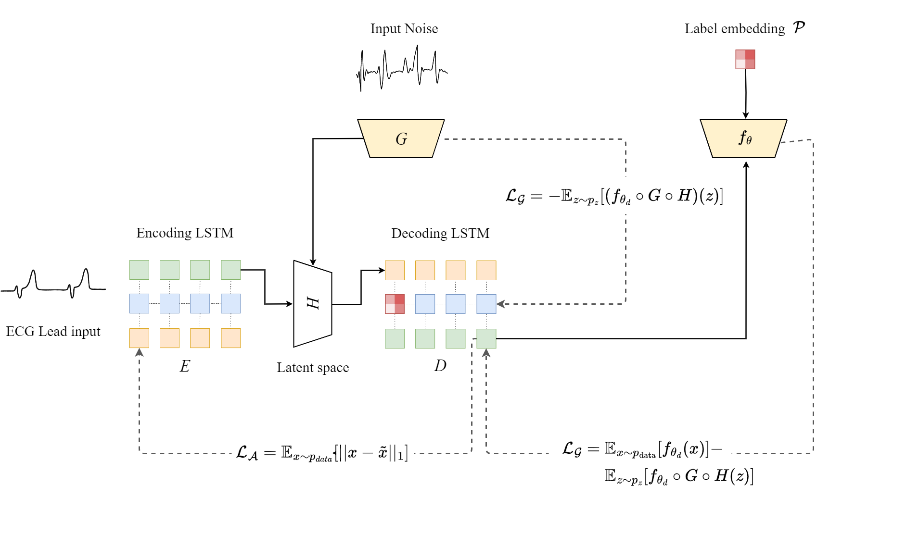

# ECGAN: Electrocardiography Generative Adversarial Network

Welcome to the ECGAN repository! This repository contains the implementation of the ECGAN architecture, a novel approach that combines self-supervised learning (SSL) and deep generative models specifically designed for electrocardiography (ECG) data.

## Overview

In this paper, we propose a novel architecture referred to as ECGAN. Our model uniquely combines two fields of research: self-supervised learning (SSL) and deep generative models for time series data. ECGAN has been devised specifically with electrocardiography data in mind, aiming to improve the generation and analysis of ECG signals.

### Key Features

- **Self-Supervised Learning**: The role of SSL in this research is to exploit the underlying time series dynamics via recurrent autoencoders.
- **Deep Generative Models**: The features learned through a preliminary reconstruction task are transferred via weight sharing to the generator and a latent space projection.
- **State-of-the-Art Performance**: ECGAN yields competitive results concerning structural fidelity, sampling diversity, and data applicability to heart rhythm classification tasks.

## Architecture

## References

1. Simone, Lorenzo, and Bacciu, Davide. **"ECGAN: Self-supervised generative adversarial network for electrocardiography."** International Conference on Artificial Intelligence in Medicine, pp. 276-280, 2023. [Springer](https://link.springer.com/)  
2. Simone, Lorenzo, Bacciu, Davide, and Gervasi, Vincenzo. **"Ecg Synthesis for Cardiac Arrhythmias: Integrating Self-Supervised Learning and Generative Adversarial Networks."** Available at SSRN: [https://ssrn.com/abstract=4884218](https://ssrn.com/abstract=4884218)
